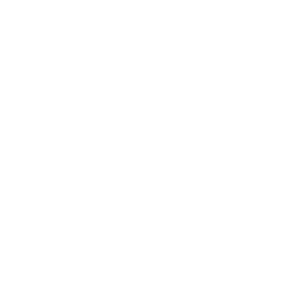

# Hello, World! 👋 I'm Akshat Dodhiya

Welcome to my GitHub playground! I'm thrilled to have you here. I'm a passionate software developer with a profound enthusiasm for crafting clean code and unraveling complex challenges. Technology, to me, is like a canvas of endless possibilities, and I'm here to paint a masterpiece.

## About Me

My coding journey embarked at a young age and has evolved into a fervent love affair with programming. I'm on a ceaseless quest to broaden my horizons and contribute meaningfully to the world of technology.

When I'm not engrossed in coding, you can find me experimenting with different programming languages, or collaborating on exciting open-source ventures. I truly believe that technology flourishes when we come together to learn, share, and innovate.

## 🔭 What I'm Currently Diving Into

- Exploring the fascinating world of artificial intelligence and its practical applications.
- Contributing to open-source projects that align with my values and stretch my capabilities.
- Learning from every experience and always on the lookout for the next challenge.

## 🌱 My Tech Garden

- Proficient in Python, Java, and C.
- Problem-solving with a touch of creativity.
- Comfortable with Windows, Linux, and macOS.
- Always learning and growing.

## 💬 Let's Connect and Collaborate

I'm a strong believer in the power of connections and collaborations. Whether you're a fellow developer, tech aficionado, or just someone who loves to chat about innovation, I'd be thrilled to connect with you. Connect with me on [LinkedIn](https://www.linkedin.com/in/akshatdodhiya).

Let's learn, grow, and innovate together in this ever-evolving tech landscape!

## 📫 How to Get in Touch

 
 

**[@akshatdodhiya](https://www.linkedin.com/in/akshatdodhiya)**
 

 

**[@akshatdodhiya](https://twitter.com/akshatdodhiya)**
 

 

**[@akshatdodhiya](https://www.youtube.com/@akshatdodhiya)**

## ➕ More about my work: 

 

**[www.akshatdodhiya.me](https://akshatdodhiya.me)**

Thanks for dropping by, and let's embark on an exciting coding journey together! 🚀
